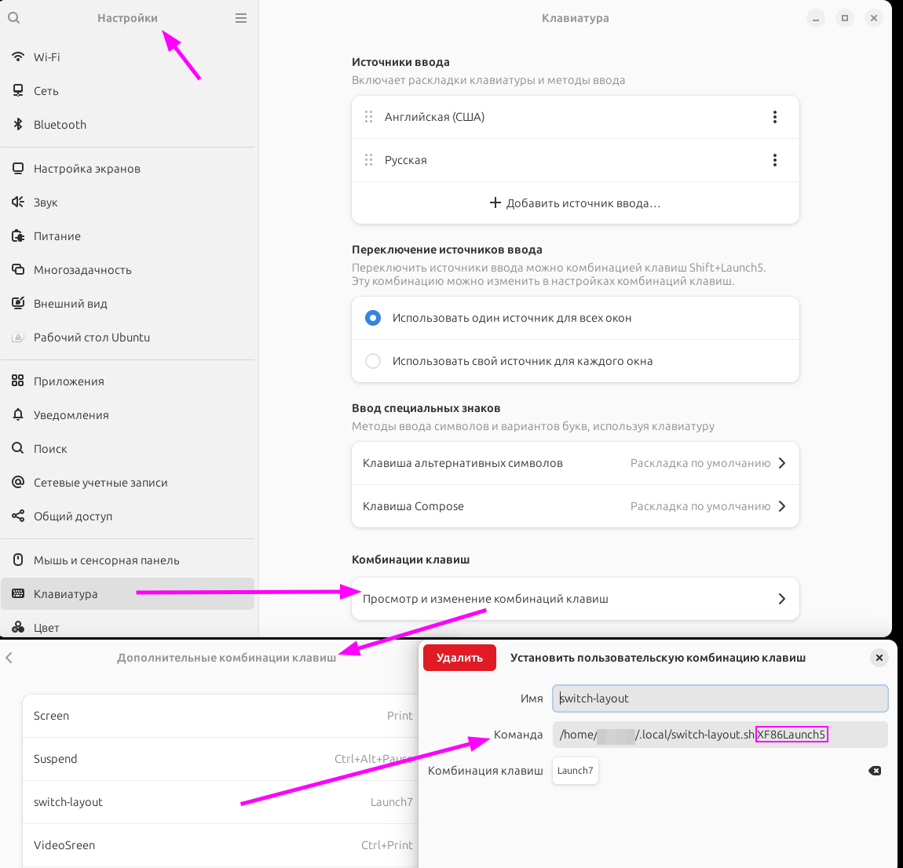

# Легкий Bash-скрипт для смены раскладки в Linux (X11).

Скрипт предназначен для быстрого исправления текста, который был случайно набран в неправильной раскладке (например, `ghbdtn` -> `привет`), с последующим автоматическим переключением на нужную языковую панель.

## Как это работает

При вызове скрипта происходит следующее:
1. Выделенный вами текст копируется.
2. Текст переводится из английской раскладки в русскую (или наоборот).
3. Исправленный текст вставляется на место исходного.
4. Выполняется нажатие клавиши для смены раскладки системы.
5. Предыдущее содержимое буфера обмена (включая картинки, HTML и т.д.) восстанавливается.

## Требования

Для работы скрипта в системе (работает в сессиях X11) должны быть установлены следующие утилиты:
* `xclip`
* `xdotool`
* Установить их (например, в Ubuntu/Debian) командой:  
`sudo apt-get update sudo apt-get install xclip xdotool`


## Настройка и использование

1. **Сохраните скрипт**
   Скачайте скрипт `SwitchLayout.sh` на ваш компьютер и сделайте его исполняемым:
   ```bash
   chmod +x /путь/к/скрипту/SwitchLayout.sh
   ```

2. **Назначьте горячую клавишу**
   В настройках вашей рабочей среды (GNOME, KDE, XFCE, i3 и т.д.) создайте новое пользовательское сочетание клавиш (например, `Ctrl+Shift+Space` или `Pause`).

3. **Укажите команду для запуска**
   В качестве команды для созданной горячей клавиши пропишите путь к скрипту и передайте параметром клавишу (или сочетание), которая у вас в системе отвечает за смену языка.
   
   * Пример команды:
   ```bash
   /путь/к/скрипту/SwitchLayout.sh "alt+shift"
   ```
   * 
   * (Вместо `alt+shift` укажите ваше сочетание, например `ctrl+shift`, `caps` или `super+space`).

4. **Использование**
   * Выделите неправильно набранный текст мышью или клавиатурой.
   * Нажмите назначенную вами горячую клавишу.
   * Текст моментально будет исправлен, а системная раскладка клавиатуры переключится.
